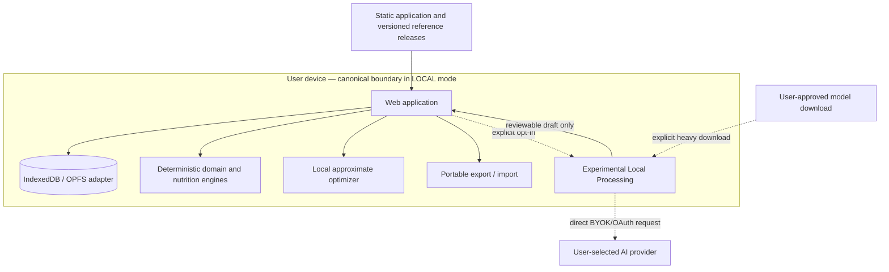
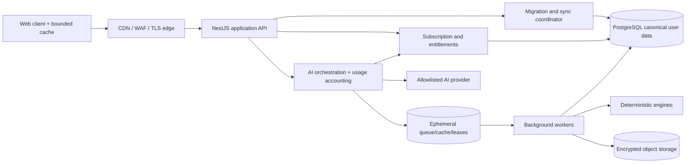

# Local-first architecture and cloud evolution

| Field            | Value                                                                                 |
| ---------------- | ------------------------------------------------------------------------------------- |
| Status           | Proposed target state                                                                 |
| Audience         | Product, architecture, web, API, security, data, operations                           |
| Owner            | Nutrixx Architecture                                                                  |
| Last reviewed    | 2026-09-27                                                                            |
| Related decisions | [ADR-0002](../decisions/ADR-0002-local-first-cloud-promotion.md), [ADR-0003](../decisions/ADR-0003-shared-canonical-model.md) |

## Architectural intent

Nutrixx first delivers the complete Free product as a browser-local system.
Cloud capabilities are additive: they change data authority and unlock
entitlements without changing nutrition semantics or forcing Free nutrition
content through Nutrixx servers.

The product has two explicit authority modes:

| Mode | Canonical user-data authority | Network dependency | Recovery model |
| --- | --- | --- | --- |
| `LOCAL` | Browser database for that browser profile | Reference assets and optional user-enabled AI only | Manual export/import; browser persistence remains best-effort |
| `CLOUD` | Nutrixx cloud database | Required for canonical writes and sync; bounded offline cache is allowed | Encrypted backup, tested restore, multi-device sync |

A profile is in exactly one authority mode. Temporary migration states never
create two writable masters.

## Local product boundary

Local mode requirements:

- nutrition content MUST remain inside the browser origin unless the user
  explicitly exports it or enables a named external processing action;
- local and cloud adapters implement the same domain repositories and canonical
  schema contracts;
- schema upgrades are transactional, resumable where possible, and preserve a
  pre-migration recovery path;
- the UI exposes storage usage, persistence status, last export, compatible
  schema version, and a clear-data control;
- reference datasets are immutable/versioned and can be re-downloaded; user
  facts remain distinct from disposable reference caches;
- deterministic engines run against immutable input snapshots regardless of
  storage mode.

## Cloud product boundary

In cloud mode PostgreSQL is the canonical operational authority for user
content. Browser storage is a bounded cache/outbox and MUST NOT silently become
a second master. Offline edits, when supported, carry stable command IDs and
explicit conflict semantics; synchronization acknowledges committed versions,
not timestamps alone.

## Shared execution model

The browser and cloud reuse:

- canonical identifiers, value objects, event/command schemas, and migrations;
- deterministic nutrition, health-context, eligibility, and validation logic;
- versioned food/scientific releases and calculation fingerprints;
- stable result types such as READY, NEEDS_INPUT, OUT_OF_SCOPE, and ERROR;
- conformance fixtures proving equivalent results across adapters.

They do not share secrets, server framework code, database clients, or an
assumption that every workflow has an HTTP API.

## Evolution sequence

This is a development sequence, not permission to market a partially fulfilled
plan. Pro and Ultimate are released only when their public plan contracts and
operational gates are satisfied. Each step is independently feature-flagged,
observable, reversible, and covered by migration/rollback evidence.

## Failure and degradation

- Free logging and deterministic calculations continue without cloud services.
- A failed upgrade leaves Local authority intact and releases any incomplete
  cloud staging data.
- A cloud outage never promotes stale cache to canonical truth; the UI exposes
  offline/read-only/pending state explicitly.
- Hosted AI failure releases reserved usage and never stores an unreviewed
  draft as a user fact.
- A full-optimizer or assistant outage does not block manual logging, cloud
  export, account access, or downgrade.
- Entitlement-service uncertainty fails closed for cost-incurring premium work
  but does not hide already-owned data.

