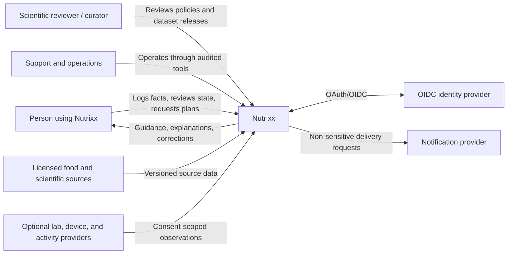
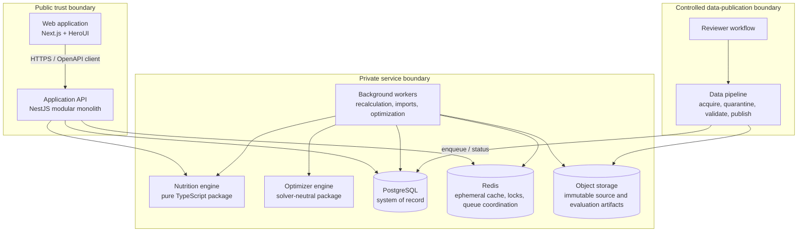
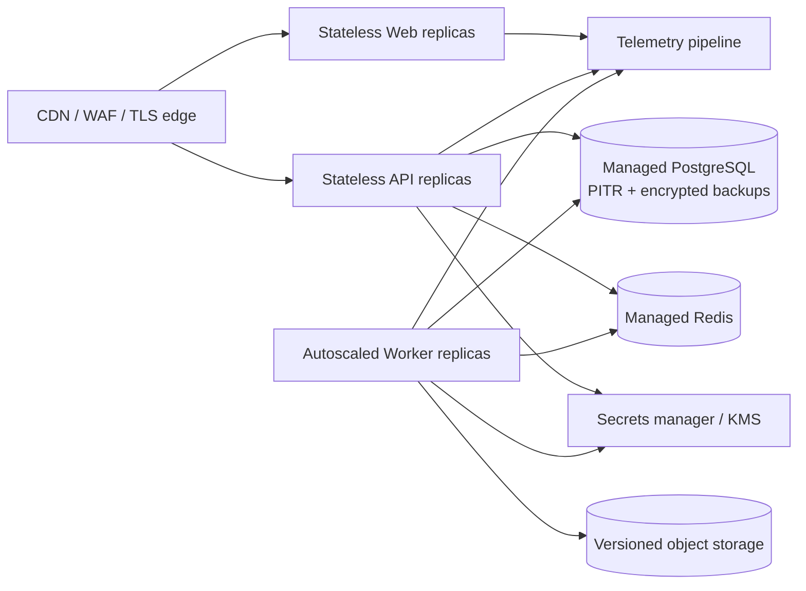

# Target architecture

| Field            | Value                                                       |
| ---------------- | ----------------------------------------------------------- |
| Status           | Proposed target state                                       |
| Audience         | Engineering, product, security, operations                  |
| Owner            | Nutrixx Architecture                                        |
| Last reviewed    | 2026-09-22                                                  |
| Related decision | [ADR-0001](../decisions/ADR-0001-modular-monolith-first.md) |

## Architecture goals

1. Keep nutrition arithmetic, eligibility, and safety deterministic and
   independently testable.
2. Minimize user effort without hiding consequential assumptions.
3. Preserve provenance and replayability across changing datasets and rules.
4. Isolate failure: tracking remains useful when planning or imports are down.
5. Scale organizational and runtime boundaries only when evidence requires it.
6. Remain cloud-, identity-provider-, solver-, and food-source-portable.

## System context — C4 level 1

Nutrixx is the authority for its own canonical facts and derived outputs. An
external source remains the authority for the raw observation it supplied.

## Containers — C4 level 2

### Container responsibilities

| Container        | Owns                                                                                      | Must not own                                                                  |
| ---------------- | ----------------------------------------------------------------------------------------- | ----------------------------------------------------------------------------- |
| Web              | Accessible interaction, local form state, rendering, safe presentation                    | Scientific formulas, safety policy, authoritative nutrient math               |
| API              | Authentication/authorization, use-case orchestration, transactions, synchronous contracts | Solver internals, vendor-specific identity logic, cross-context data mutation |
| Worker           | Durable asynchronous orchestration, retries, progress, recomputation                      | Unversioned formulas or hidden policy                                         |
| Nutrition engine | Units, composition aggregation, targets, uncertainty, fingerprints                        | Network, database, framework, UI                                              |
| Optimizer engine | Feasibility, objective model, diagnostics, deterministic result structure                 | Fetching mutable user/data state, direct publication to users                 |
| PostgreSQL       | Canonical operational facts, versioned policies and snapshots, outbox                     | Large raw source blobs, queue-only ephemeral state                            |
| Redis            | Short-lived cache, rate limits, leases, queue coordination                                | Sole copy of user facts or scientific evidence                                |
| Object storage   | Immutable imports, evaluation corpora, large reports                                      | Query-time canonical identity                                                 |
| Data pipeline    | Untrusted ingestion, mapping, validation, release assembly                                | Direct mutation of an active release                                          |

## Architectural style

The primary API is a modular monolith with bounded-context modules, explicit
ports/adapters, and architecture tests. This gives one transactional boundary
while the domain and team are still changing. Background workers reuse the
same application/domain packages but run separate processes.

Modules communicate in-process through public application interfaces and
asynchronously through versioned domain events. They do not reach into another
module's repositories or tables. The transactional outbox connects committed
state to event delivery.

Microservices are an extraction option, not a starting assumption. A module may
be extracted only when measured scaling, isolation, release cadence, security,
or team-ownership pressure outweighs distributed-system cost.

## Deployment view

Local, preview, staging, and production use the same immutable image definitions
with environment-specific configuration. Production data never flows to lower
environments. The deployment platform remains an open decision.

## Cross-cutting decisions

| Concern       | Target policy                                                                                                |
| ------------- | ------------------------------------------------------------------------------------------------------------ |
| Identity      | OIDC/OAuth 2.0 Authorization Code with PKCE through a provider adapter                                       |
| Authorization | Deny-by-default policies at API/application boundaries; user ownership plus explicit reviewer/operator roles |
| Contracts     | Design-first OpenAPI; generated/validated client types; RFC 9457 problem details                             |
| Persistence   | PostgreSQL with owned schemas/repositories and numeric/decimal scientific quantities                         |
| Asynchrony    | Durable jobs with idempotency keys, bounded retry, dead-letter handling, and observable status               |
| Events        | Transactional outbox; versioned envelopes; idempotent consumers                                              |
| Caching       | Derived and disposable; keys include tenant/user scope and relevant data/rule versions                       |
| Observability | Vendor-neutral OpenTelemetry traces, metrics, and structured logs; no sensitive payloads                     |
| Configuration | Typed startup validation; secrets from a secret manager; no environment branching in domain logic            |
| Delivery      | Immutable signed images, SBOM/provenance, staged promotion, automated rollback evidence                      |

## Deliberately deferred

Kubernetes, event-streaming platforms, service meshes, multi-region writes,
feature stores, and independent microservice databases are not selected until a
quality scenario proves the need.
