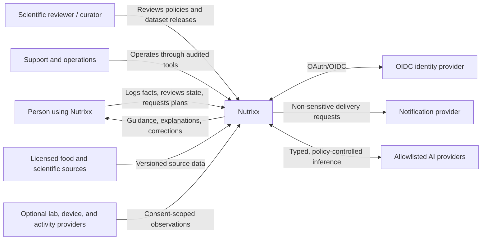
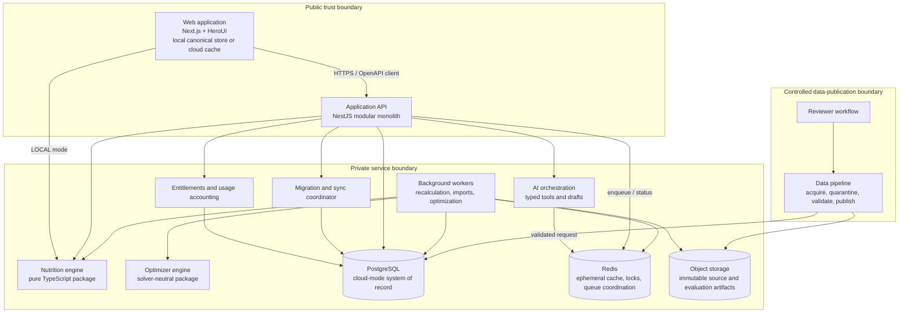
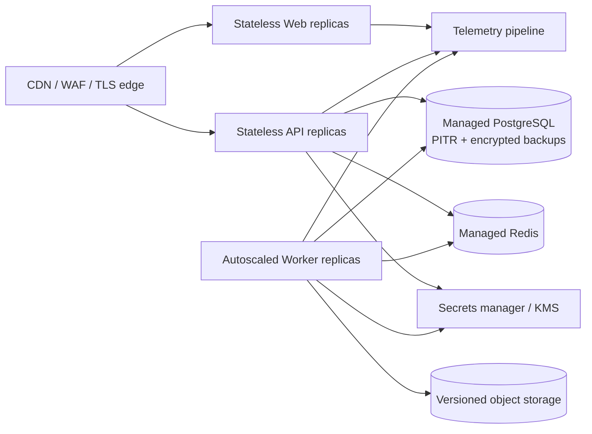

# Target architecture

| Field            | Value                                                                                                                                                                                                                                                                                                                               |
| ---------------- | ----------------------------------------------------------------------------------------------------------------------------------------------------------------------------------------------------------------------------------------------------------------------------------------------------------------------------------- |
| Status           | Proposed target state                                                                                                                                                                                                                                                                                                               |
| Audience         | Engineering, product, security, operations                                                                                                                                                                                                                                                                                          |
| Owner            | Nutrixx Architecture                                                                                                                                                                                                                                                                                                                |
| Last reviewed    | 2026-09-27                                                                                                                                                                                                                                                                                                                          |
| Related decision | [ADR-0001](../decisions/ADR-0001-modular-monolith-first.md), [ADR-0002](../decisions/ADR-0002-local-first-cloud-promotion.md), [ADR-0003](../decisions/ADR-0003-shared-canonical-model.md), [ADR-0004](../decisions/ADR-0004-entitlement-and-usage-accounting.md), [ADR-0005](../decisions/ADR-0005-tool-mediated-generative-ai.md) |

## Architecture goals

1. Keep nutrition arithmetic, eligibility, and safety deterministic and
   independently testable.
2. Minimize user effort without hiding consequential assumptions.
3. Preserve provenance and replayability across changing datasets and rules.
4. Isolate failure: tracking remains useful when planning or imports are down.
5. Scale organizational and runtime boundaries only when evidence requires it.
6. Remain cloud-, identity-provider-, solver-, and food-source-portable.
7. Deliver a complete local-first product before adding optional cloud custody.
8. Keep entitlement, hosted-AI usage, and consequential assistant actions
   explicit, auditable, and independent of client presentation state.

## System context — C4 level 1

In `LOCAL` mode, the browser profile is the authority for user-entered
nutrition facts. In `CLOUD` mode, Nutrixx cloud is their authority and browser
storage is a bounded cache/outbox. An external source remains the authority for
the raw observation it supplied. See
[Local-first architecture and cloud evolution](local-first-evolution.md).

## Containers — C4 level 2

### Container responsibilities

| Container        | Owns                                                                                                                                  | External ownership                                                               |
| ---------------- | ------------------------------------------------------------------------------------------------------------------------------------- | -------------------------------------------------------------------------------- |
| Web              | Accessible interaction, local canonical persistence in `LOCAL` mode, cloud cache/outbox in `CLOUD` mode, rendering, safe presentation | Invented scientific formulas, hidden cloud upload, server entitlement authority  |
| API              | Authentication/authorization, use-case orchestration, transactions, synchronous contracts                                             | Solver internals, vendor-specific identity logic, cross-context data mutation    |
| Worker           | Durable asynchronous orchestration, retries, progress, recomputation                                                                  | Unversioned formulas or hidden policy                                            |
| Nutrition engine | Units, composition aggregation, targets, uncertainty, fingerprints                                                                    | Network, database, framework, UI                                                 |
| Optimizer engine | Feasibility, objective model, diagnostics, deterministic result structure                                                             | Fetching mutable user/data state, direct publication to users                    |
| PostgreSQL       | Cloud-mode canonical facts, accounts, entitlements, usage ledger, versioned policies, snapshots, outbox                               | Free local nutrition content, large raw source blobs, queue-only ephemeral state |
| Redis            | Short-lived cache, rate limits, leases, queue coordination                                                                            | Sole copy of user facts or scientific evidence                                   |
| Object storage   | Immutable imports, evaluation corpora, large reports                                                                                  | Query-time canonical identity                                                    |
| Data pipeline    | Untrusted ingestion, mapping, validation, release assembly                                                                            | Direct mutation of an active release                                             |
| Entitlements     | Plan grants, effective periods, usage reservations, consumption and reconciliation                                                    | Client pricing copy, nutrition decisions, payment-card data                      |
| AI orchestration | Provider policy, typed draft/tool schemas, safety boundaries, usage lifecycle                                                         | Canonical nutrition math, direct unconfirmed writes                              |
| Migration/sync   | Authority-mode transition, manifests, integrity verification, cursor/conflict protocol                                                | Two writable masters or silent last-write-wins                                   |

## Architectural style

The primary API is a modular monolith with bounded-context modules, explicit
ports/adapters, and architecture tests. This gives one transactional boundary
while the domain and team are still changing. Background workers reuse the
same application/domain packages but run separate processes.

Modules communicate in-process through public application interfaces and
asynchronously through versioned domain events. Each module's repositories and
tables remain under its exclusive control. The transactional outbox connects committed
state to event delivery.

The modular monolith is the starting architecture. A module may
be extracted only when measured scaling, isolation, release cadence, security,
or team-ownership pressure outweighs distributed-system cost.

## Deployment view

The cloud plane is absent from a Free local session except for static/reference
delivery and explicit user-enabled processing. Local, preview, staging, and
production use the same immutable image definitions with environment-specific
configuration. Lower environments use synthetic or approved masked data. The
deployment platform remains an open decision.

## Cross-cutting decisions

| Concern       | Target policy                                                                                                            |
| ------------- | ------------------------------------------------------------------------------------------------------------------------ |
| Identity      | OIDC/OAuth 2.0 Authorization Code with PKCE through a provider adapter                                                   |
| Authorization | Deny-by-default policies at API/application boundaries; user ownership plus explicit reviewer/operator roles             |
| Contracts     | Design-first OpenAPI; generated/validated client types; RFC 9457 problem details                                         |
| Persistence   | Storage-neutral canonical contracts; IndexedDB/OPFS adapter in `LOCAL`, PostgreSQL owned schemas/repositories in `CLOUD` |
| Asynchrony    | Durable jobs with idempotency keys, bounded retry, dead-letter handling, and observable status                           |
| Events        | Transactional outbox; versioned envelopes; idempotent consumers                                                          |
| Caching       | Derived and disposable; keys include tenant/user scope and relevant data/rule versions                                   |
| Observability | Vendor-neutral OpenTelemetry traces, metrics, and structured logs; no sensitive payloads                                 |
| Configuration | Typed startup validation; secrets from a secret manager; no environment branching in domain logic                        |
| Delivery      | Immutable signed images, SBOM/provenance, staged promotion, automated rollback evidence                                  |
| Entitlements  | Server-authoritative versioned grants; reserve/consume/release ledger; idempotent reconciliation                         |
| Generative AI | Candidate generation only; typed validation; no arithmetic/safety authority; confirmation before canonical writes        |
| Data mobility | Versioned portable bundles and verified single-authority promotion/demotion                                              |

## Deliberately deferred

Kubernetes, event-streaming platforms, service meshes, multi-region writes,
feature stores, and independent microservice databases require a qualifying
quality scenario and an accepted ADR before selection.
