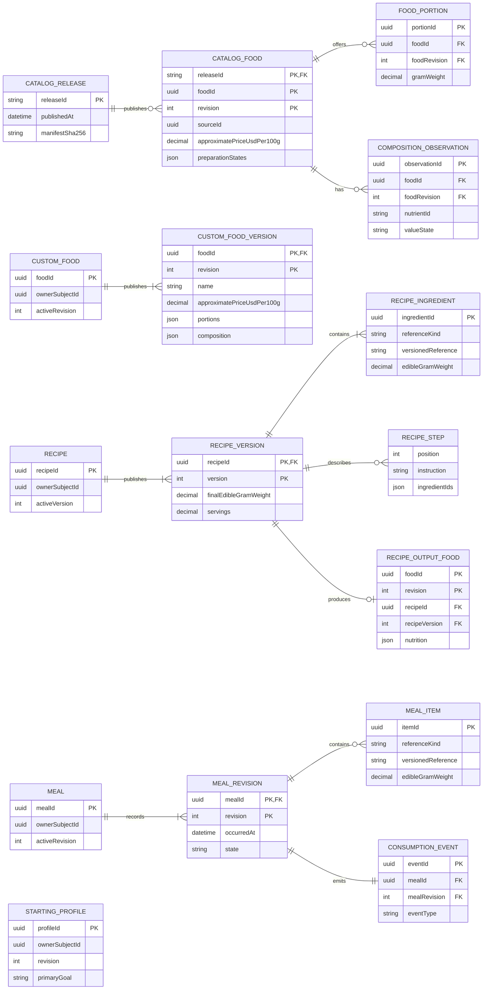

# Current logical entity relationships

| Field         | Value                                  |
| ------------- | -------------------------------------- |
| Status        | Implemented local scope                |
| Audience      | Product, data, application engineering |
| Owner         | Nutrixx Data                           |
| Last reviewed | 2026-10-07                             |

This view shows the food, recipe, meal, and starting-profile concepts currently
implemented for local use. It describes domain relationships. The
[physical storage view](current-storage-er.md) shows the SQL table and IndexedDB
object stores where these concepts are stored.

`ownerSubjectId` associates the starting profile, custom foods, recipes, and
meals with the same local subject. The starting profile is a separate record;
the association uses subject identity rather than a physical `profileId`
foreign key.

`approximatePriceUsdPer100g` is optional. It is an illustrative USD amount for
100 g of food and remains separate from USDA nutrient facts and live market
quotes. Three exact foods in the pinned catalog receive product example values
at read time; the integrity-checked USDA artifact remains unchanged.

`RECIPE_INGREDIENT` and `MEAL_ITEM` each carry one versioned reference. The
reference can identify a catalog food, a custom-food version, a recipe output
food, or an exact recipe version according to its reference kind and release.
The diagram leaves those polymorphic links as fields to avoid implying a
single foreign key. Recipe ingredients and steps are embedded in recipe-version
payloads; meal items are embedded in meal-revision payloads. Custom-food
portions and composition are embedded in custom-food versions. A voided meal
revision has no items while its earlier revisions remain available.
