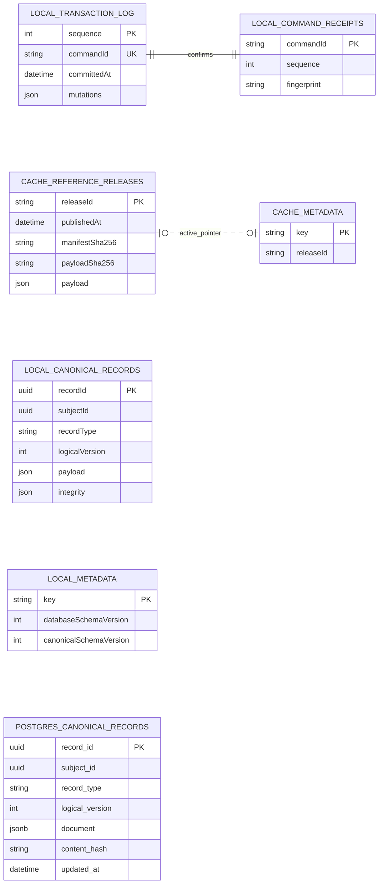

# Current physical storage relationships

| Field         | Value                       |
| ------------- | --------------------------- |
| Status        | Implemented adapters        |
| Audience      | Data, application engineers |
| Owner         | Nutrixx Data                |
| Last reviewed | 2026-10-07                  |

This view shows the actual version `1` IndexedDB object stores and the
PostgreSQL table implemented by its repository adapter. The local website uses
the two separate IndexedDB databases. The PostgreSQL adapter is implemented
and contract-tested for server-side use. The
[logical entity view](current-logical-er.md) describes the domain contents.

| Database or adapter                 | Physical structure                                                                                         |
| ----------------------------------- | ---------------------------------------------------------------------------------------------------------- |
| `nutrixx-user-data` IndexedDB       | `canonical-records`, `transaction-log`, `command-receipts`, and `metadata` object stores                   |
| `nutrixx-reference-cache` IndexedDB | `reference-releases` and `cache-metadata` object stores; the catalog payload stays inside a cached release |
| PostgreSQL repository adapter       | One `canonical_records` table with a JSONB `document` and an index on `(subject_id, record_id)`            |

The `canonical-records` store holds starting profiles, custom-food versions,
recipe versions, meal revisions, their heads, and related canonical records
together. `recordType` distinguishes them. Its primary key is `recordId`, and
`subjectId` has an IndexedDB index. The transaction log records committed
mutations, while the command receipt points to the corresponding sequence;
all three stores update atomically for a local command. The reference cache is
separate from user data and is excluded from user-data exports.

These diagrams show logical key associations between stores; repository logic
governs their consistency. The PostgreSQL adapter has one generic canonical
table, with food, recipe, and meal record types inside its JSONB documents. The target-state
[data architecture](architecture.md) describes capabilities beyond this
implemented local storage layout.
