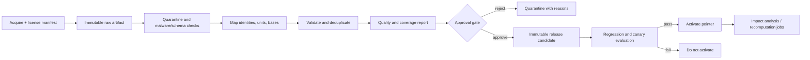

# Data publication and quality

| Field         | Value                                                     |
| ------------- | --------------------------------------------------------- |
| Status        | Proposed target state                                     |
| Audience      | Data engineering, nutrition science, security, operations |
| Owner         | Nutrixx Data                                              |
| Last reviewed | 2026-09-22                                                |

## Pipeline

Ingestion never writes directly into the active catalog. Activation updates a
version pointer; rollback selects the previous accepted release.

## Release manifest

Each release contains:

- source artifacts, checksums, provider revisions, and license/use constraints;
- canonical schema and mapping versions;
- included/excluded record counts and rejection reasons;
- identity merge/split decisions;
- unit, range, dimensional, and duplicate validation results;
- coverage by nutrient, food category, cuisine/market, and preparation state;
- comparison against the previous release;
- reviewer approvals, timestamps, and release hash.

## Blocking checks

A release cannot activate with:

- an unknown or incompatible unit/basis in a published quantity;
- a canonical ID collision or unresolved merge;
- missing source version or incompatible license;
- an impossible/unsafe range according to an accepted validation rule;
- a regression beyond the approved threshold;
- a missing lineage path for a calculated value;
- unreviewed changes to eligibility, target, or upper-limit semantics.

Outliers are quarantined, not silently clipped. Corrections create a new release.

## Change impact

Before activation, the pipeline samples or replays representative meals,
recipes, nutrition states, and optimizer cases. It reports changed outputs and
whether the change crosses user-visible or safety thresholds.

Historical snapshots preserve their original release IDs. Recalculation creates
new snapshots and never rewrites prior evidence.

## Authoritative source examples

Provider selection and licensing remain open decisions. Candidate sources must
be evaluated for coverage, update semantics, provenance, and permitted use.
The model is compatible with sources such as
[USDA FoodData Central](https://fdc.nal.usda.gov/data-documentation/), but this
reference is not a commitment to one provider.
