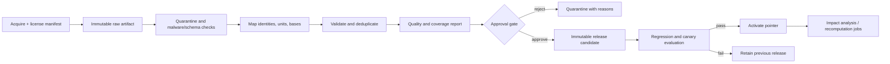

# Data publication and quality

| Field         | Value                                                     |
| ------------- | --------------------------------------------------------- |
| Status        | Proposed target state                                     |
| Audience      | Data engineering, nutrition science, security, operations |
| Owner         | Nutrixx Data                                              |
| Last reviewed | 2026-10-04                                                |

## Pipeline

Ingestion writes to quarantined release candidates. Activation updates a version
pointer; rollback selects the previous accepted release.

## Release manifest

Each release contains:

- source artifacts, checksums, provider revisions, and license/use constraints;
- canonical schema and mapping versions;
- included/excluded record counts and rejection reasons;
- identity merge/split decisions;
- unit, range, dimensional, and duplicate validation results;
- coverage by nutrient, food category, cuisine/market, and preparation state;
- comparison against the previous release;
- reviewer approvals, timestamps, and release hash.

## Blocking checks

Activation requires resolution of every blocking condition:

- an unknown or incompatible unit/basis in a published quantity;
- a canonical ID collision or unresolved merge;
- missing source version or incompatible license;
- an impossible/unsafe range according to an accepted validation rule;
- a regression beyond the approved threshold;
- a missing lineage path for a calculated value;
- unreviewed changes to eligibility, target, or upper-limit semantics.

Outliers enter quarantine with explicit reasons. Corrections create a new release.

## Change impact

Before activation, the pipeline samples or replays representative meals,
recipes, nutrition states, and optimizer cases. It reports changed outputs and
whether the change crosses user-visible or safety thresholds.

Historical snapshots preserve their original release IDs. Recalculation creates
new snapshots while preserving prior evidence.

## Accepted source policy

[ADR-0007](../decisions/ADR-0007-food-catalog-sources-and-release-quality.md)
is authoritative for provider admission, licenses, international coverage,
release cadence, and blocking thresholds. The first catalog release normalizes
USDA FoodData Central Foundation Foods and SR Legacy under CC0.

The active catalog exposes regional gaps, preserves missing nutrient states,
labels user-selected approximate substitutions, and publishes each source with
an approved license manifest and reproducible release evidence.
