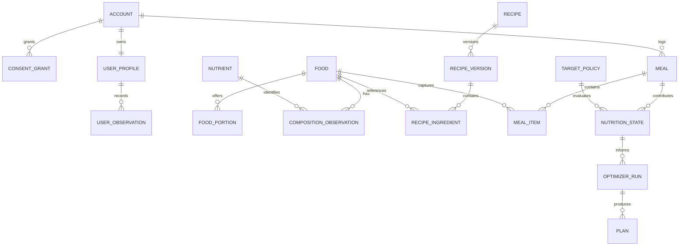

# Domain model

| Field         | Value                           |
| ------------- | ------------------------------- |
| Status        | Proposed target model           |
| Audience      | Architecture, engineering, data |
| Owner         | Nutrixx Architecture            |
| Last reviewed | 2026-09-22                      |

## Aggregates and invariants

| Bounded context    | Aggregate roots                           | Principal invariants                                                                                                           |
| ------------------ | ----------------------------------------- | ------------------------------------------------------------------------------------------------------------------------------ |
| Identity & Consent | Account, ConsentGrant                     | Consent is purpose-specific, revocable, time-bound where required, and auditable.                                              |
| User Context       | Profile, GoalSet, ObservationSeries       | Facts keep effective time, source, unit, and correction history. Eligibility-critical facts cannot be guessed silently.        |
| Food Knowledge     | Food, PortionSet, CompositionRecord       | Every amount has an explicit basis and provenance. Missing is distinct from measured zero.                                     |
| Recipe Knowledge   | Recipe, RecipeVersion                     | Published versions are immutable; ingredients resolve to exact versions; yield and edible basis are explicit.                  |
| Consumption        | Meal                                      | Items preserve the consumed quantity and referenced version known at the event time. User corrections append audit history.    |
| Nutrition Science  | NutrientDefinition, TargetPolicy, RuleSet | Definitions and policies are versioned, reviewed, applicable to named populations, and effective-dated.                        |
| Nutrition State    | StateSnapshot                             | A snapshot records its period, input watermark, engine/rule/data versions, completeness, and uncertainty.                      |
| Planning           | PlanningRequest, OptimizerRun, Plan       | Only eligible, independently validated results become user-visible. Hard constraints are never silently relaxed.               |
| Data Publication   | ImportBatch, DatasetRelease               | Untrusted source records remain quarantined until mapped, validated, licensed, and approved. Published releases are immutable. |
| Audit & Provenance | EvidenceTrace                             | Important decisions can be reconstructed without reading mutable operational tables.                                           |

## Conceptual relationships

The diagram is conceptual: storage may normalize or partition differently.
Cross-context references are opaque identifiers or published value snapshots,
not foreign-key permission to mutate another context.

## Domain events

| Event                        | Producer           | Typical consumers                                 |
| ---------------------------- | ------------------ | ------------------------------------------------- |
| MealRecorded / MealCorrected | Consumption        | Nutrition State, Audit                            |
| ObservationRecorded          | User Context       | Eligibility, Nutrition State                      |
| RecipeVersionPublished       | Recipe Knowledge   | Food Knowledge, Planning                          |
| DatasetReleasePublished      | Data Publication   | Food Knowledge, recomputation coordinator         |
| RuleSetActivated             | Nutrition Science  | Nutrition State, Planning, impact analysis        |
| NutritionStateComputed       | Nutrition State    | Web notifications, Planning, Audit                |
| PlanRequested                | Planning           | Optimizer worker                                  |
| PlanValidated / PlanRejected | Planning           | Web, Audit, evaluation pipeline                   |
| ConsentRevoked               | Identity & Consent | Integration shutdown, deletion/retention workflow |

Events are published transactionally through an outbox. Consumers MUST be
idempotent, traceable, and tolerant of duplicates and delayed delivery.
