# Storage-mode lifecycle

| Field         | Value                                           |
| ------------- | ----------------------------------------------- |
| Status        | Proposed target state                           |
| Audience      | Product, application, data, privacy, operations |
| Owner         | Nutrixx Data and Architecture                   |
| Last reviewed | 2026-09-27                                      |

## Invariant

Every user-data profile has one canonical authority mode. `LOCAL` means the
browser database is authoritative. `CLOUD_ACTIVE` means the Nutrixx cloud is
authoritative and browser data is a bounded cache/outbox. No workflow exposes
both copies as independently writable masters.

## Lifecycle

```mermaid
stateDiagram-v2
    [*] --> LOCAL
    LOCAL --> UPLOAD_STAGING: User purchases and starts upgrade
    UPLOAD_STAGING --> VERIFYING_CLOUD: Upload complete
    UPLOAD_STAGING --> LOCAL: Cancel or transport failure
    VERIFYING_CLOUD --> LOCAL: Verification failure; staging removed
    VERIFYING_CLOUD --> CLOUD_READY: Schema, count, hash and replay checks pass
    CLOUD_READY --> CLOUD_ACTIVE: Authority switch committed
    CLOUD_ACTIVE --> LOCAL_CLEANUP_PENDING: User approves local cleanup
    LOCAL_CLEANUP_PENDING --> CLOUD_ACTIVE: Full local database removed
    CLOUD_ACTIVE --> DOWNGRADE_EXPORTING: Subscription ends or user downgrades
    DOWNGRADE_EXPORTING --> CLOUD_ACTIVE: Export or local verification fails
    DOWNGRADE_EXPORTING --> LOCAL_WITH_CLOUD_GRACE: Local verified; authority switch committed
    LOCAL_WITH_CLOUD_GRACE --> LOCAL: Grace expires; cloud deletion verified
```



## Upgrade protocol

1. Freeze a consistent local snapshot and record schema, reference-data,
   scientific-policy, and engine versions.
2. Create an idempotent `MigrationSession` and an encrypted server-side staging
   area that is not visible to normal cloud reads.
3. Upload bounded chunks with sequence numbers, content hashes, and resume
   tokens. Never log payload contents.
4. Validate schema compatibility, record counts, relationships, versions,
   decimal/unit semantics, aggregate hashes, and representative replay cases.
5. Commit the authority switch atomically and make the server copy visible.
6. Retain an encrypted migration recovery artifact for the approved short
   recovery window.
7. Ask the user to remove the full local database. After confirmation, delete
   it and retain only the documented bounded cache and non-sensitive settings.

Purchase completion alone MUST NOT delete local content. A failed or abandoned
migration leaves Local authority and usability intact. Staging data expires and
is verifiably removed.

## Downgrade protocol

1. Keep cloud data readable and export available during the grace period,
   including payment failure and cancellation.
2. Generate a complete portable snapshot with manifest, schema version,
   checksums, record counts, provenance references, and required reference
   release identifiers.
3. Import into browser staging, run schema/relationship checks and deterministic
   replay samples, then show required storage and limitations.
4. Commit Local authority only after verification and user acknowledgement.
5. Make the cloud copy read-only, then delete it according to the approved
   retention and backup-expiry schedule. Produce deletion evidence without
   retaining sensitive payloads.

If the browser lacks sufficient storage or a compatible runtime, the user keeps
read-only cloud access and export capability while choosing another supported
device or destination. Nutrixx MUST NOT destroy the only valid copy.

## Synchronization in cloud mode

Cloud synchronization uses versioned commands and acknowledgements:

```text
client_id + command_id + aggregate_id + expected_version + payload_version
→ authorization / entitlement / invariant validation
→ atomic commit + event/outbox
→ committed aggregate version + safe conflict/result
```

Conflicts are domain-specific. Additive observations may merge; edits to the
same meal or recipe require version-aware resolution. Last-write-wins by wall
clock is prohibited for consequential nutrition facts.

## Portability bundle

A complete bundle contains user-entered facts, corrections, immutable recipe
versions, preferences/goals, observations, derived snapshots required for
understanding history, plans, fingerprints, provenance pointers, schema and
release manifests, and a machine-readable integrity manifest. Licensed source
data that cannot be redistributed is represented by identifiers and a clear
reacquisition/limitation record.

## Recovery and support

Support can inspect migration state, safe counts, hashes, timestamps, and error
codes but cannot browse nutrition content by default. Recovery actions are
idempotent, attributable, and previewed. Customer-reported loss or mismatch is
treated as a high-priority integrity incident; the safest valid copy is
preserved until reconciliation completes.
