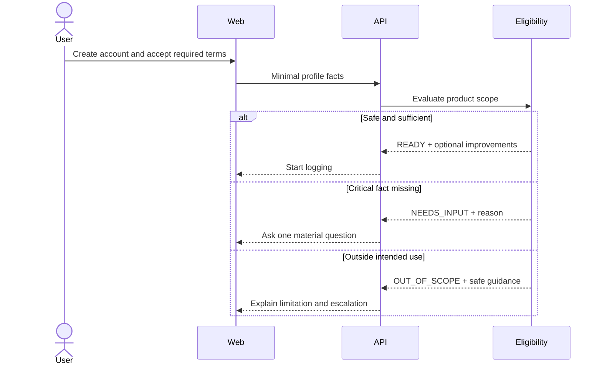
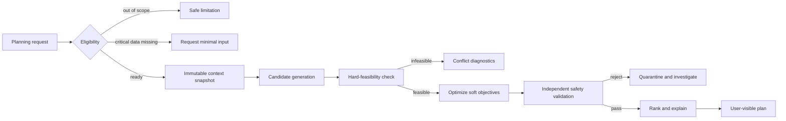

# Critical workflows

| Field         | Value                            |
| ------------- | -------------------------------- |
| Status        | Proposed target state            |
| Audience      | Product, engineering, quality    |
| Owner         | Nutrixx Product and Architecture |
| Last reviewed | 2026-09-22                       |

## Responsibility model

| User is responsible for                                                                                   | Nutrixx is responsible for                                                                                                    |
| --------------------------------------------------------------------------------------------------------- | ----------------------------------------------------------------------------------------------------------------------------- |
| Reporting foods, quantities, corrections, preferences, and optional observations as honestly as practical | Search, normalization, unit conversion, nutrient math, provenance, uncertainty, target selection, validation, and explanation |
| Confirming ambiguous matches when the distinction materially changes a result                             | Avoiding unnecessary questions and explaining why a critical question is needed                                               |
| Choosing whether to share optional health or integration data                                             | Consent, isolation, retention, deletion, and safe handling                                                                    |
| Choosing among safe alternatives and seeking professional care when directed                              | Staying inside intended use and refusing unsafe or unsupported conclusions                                                    |

## Progressive onboarding

## Meal logging and daily state

1. The user selects or creates a food/recipe and provides a practical quantity.
2. Nutrixx resolves portion, preparation, edible basis, and source version.
3. The user confirms only material ambiguity.
4. Consumption stores the event and publishes MealRecorded.
5. Nutrition State incrementally aggregates known nutrients, completeness, and
   uncertainty against applicable targets.
6. The UI shows known results and limitations; missing values never appear as
   zero.

## Planning

The user can accept, substitute, or reject a recommendation. Every substitution
is solved or validated again; a text generator cannot improvise a replacement.

## Data publication

Source acquisition → license check → quarantine → schema validation → canonical
mapping → unit and identity checks → deduplication → quality report → human
approval where required → immutable release → canary evaluation → activation.

Activation and rollback are separate from ingestion. Historical calculations
keep the release version originally used.
