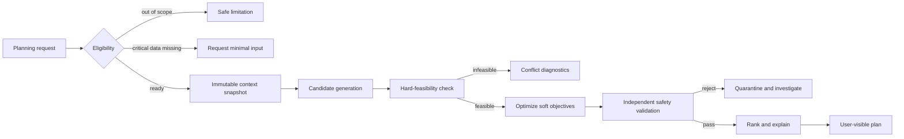
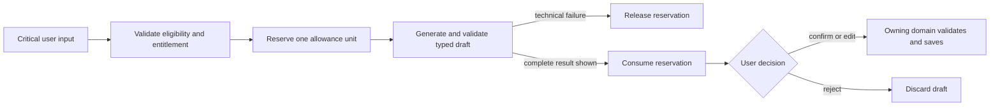

# Critical workflows

| Field         | Value                            |
| ------------- | -------------------------------- |
| Status        | Proposed target state            |
| Audience      | Product, engineering, quality    |
| Owner         | Nutrixx Product and Architecture |
| Last reviewed | 2026-09-27                       |

## Responsibility model

| User is responsible for                                                                                   | Nutrixx is responsible for                                                                                                    |
| --------------------------------------------------------------------------------------------------------- | ----------------------------------------------------------------------------------------------------------------------------- |
| Reporting foods, quantities, corrections, preferences, and optional observations as honestly as practical | Search, normalization, unit conversion, nutrient math, provenance, uncertainty, target selection, validation, and explanation |
| Confirming ambiguous matches when the distinction materially changes a result                             | Avoiding unnecessary questions and explaining why a critical question is needed                                               |
| Choosing whether to create a cloud account or share optional health/integration data                       | Local use without account, informed consent, isolation, retention, deletion, and safe handling                                 |
| Keeping a local export when browser-only data is important to them                                         | Visible storage status, export/import, persistence guidance, and verified cloud migration                                      |
| Choosing among safe alternatives and seeking professional care when directed                              | Staying inside intended use and refusing unsafe or unsupported conclusions                                                    |

## Progressive onboarding

```mermaid
sequenceDiagram
    actor User
    participant Web
    participant Eligibility
    participant LocalStore
    User->>Web: Accept required terms and enter minimal facts
    Web->>Eligibility: Evaluate product scope locally
    alt Safe and sufficient
        Eligibility-->>Web: READY + optional improvements
        Web->>LocalStore: Persist canonical local profile
        Web-->>User: Start logging; account remains optional
    else Critical fact missing
        Eligibility-->>Web: NEEDS_INPUT + reason
        Web-->>User: Ask one material question
    else Outside intended use
        Eligibility-->>Web: OUT_OF_SCOPE + safe guidance
        Web-->>User: Explain limitation and escalation
    end
```

The workflow is storage-neutral: in `LOCAL`, the browser transaction is
canonical; in `CLOUD`, the equivalent command is authorized and committed by
the API. The eligibility rule and result contract are identical.

## Meal logging and daily state

1. The user selects or creates a food/recipe and provides a practical quantity.
2. Nutrixx resolves portion, preparation, edible basis, and source version.
3. The user confirms only material ambiguity.
4. Consumption stores the event and publishes MealRecorded.
5. Nutrition State incrementally aggregates known nutrients, completeness, and
   uncertainty against applicable targets.
6. The UI shows known results and limitations; missing values never appear as
   zero.

Manual meal and recipe entry has no product quota in any plan. AI-assisted
capture is an optional draft-producing path documented in
[AI-assisted capture](../engines/ai-assisted-capture.md).

## Planning



The user can accept, substitute, or reject a recommendation. Every substitution
is solved or validated again; a text generator cannot improvise a replacement.

## Data publication

Source acquisition → license check → quarantine → schema validation → canonical
mapping → unit and identity checks → deduplication → quality report → human
approval where required → immutable release → canary evaluation → activation.

Activation and rollback are separate from ingestion. Historical calculations
keep the release version originally used.

## Storage-mode changes

Upgrade and downgrade are data-integrity workflows, not payment-page side
effects. They use staged copy, manifest verification, a single authority
switch, recovery evidence, and delayed source cleanup. See
[Storage-mode lifecycle](storage-mode-lifecycle.md).

## Hosted AI action



Showing a complete usable result consumes the allowance even if the user later
rejects it. Technical failure releases it. Retrying the same failed action uses
the same idempotency identity. No draft becomes a fact before confirmation.
