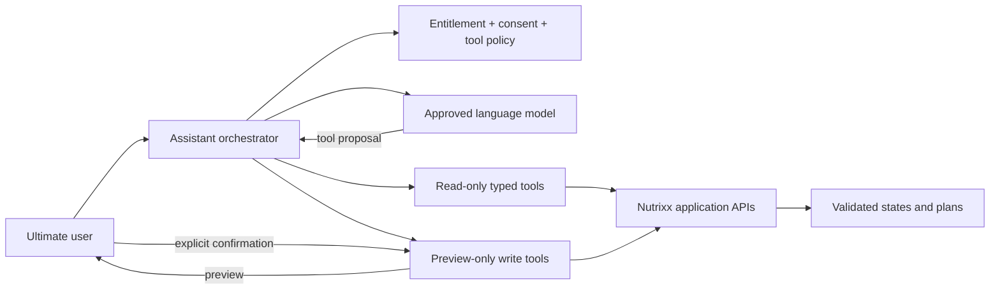

# Conversational plan assistant

| Field         | Value                                               |
| ------------- | --------------------------------------------------- |
| Status        | Proposed target design                              |
| Audience      | Product, AI, application, security, quality, safety |
| Owner         | Nutrixx AI Engineering                              |
| Last reviewed | 2026-09-27                                          |

## Purpose

The Ultimate assistant lets an entitled user ask questions about their current
nutrition state and plans. It obtains facts through approved Nutrixx APIs when
needed, explains validated results, and can prepare supported actions for user
confirmation. It is not the nutrition engine, optimizer, policy authority, or
medical professional.

## Architecture boundary

The model has no database credentials, unrestricted HTTP client, arbitrary code
execution, or direct write capability. The orchestrator validates every tool
name, schema, scope, ownership, purpose, freshness, cost budget, and result.

## Tool classes

| Class         | Examples                                                                                      | Policy                                                          |
| ------------- | --------------------------------------------------------------------------------------------- | --------------------------------------------------------------- |
| Read          | Current plan, nutrient contributors, approved alternatives, calculation trace                 | Least data necessary; no hidden cross-user or privileged access |
| Analysis      | Compare validated plans, request deterministic recomputation, explain trade-offs              | Result must reference typed output and versions                 |
| Preview write | Prepare meal correction, preference change, substitution, or new optimizer request            | Returns diff, consequences, and required confirmation           |
| Prohibited    | Diagnose disease, change medication, override safety, raw database query, arbitrary URL fetch | Never exposed to the model                                      |

Confirmation is bound to the exact preview hash, tool parameters, user,
authority version, and expiry. Any material change requires a new preview.

## Response policy

Every consequential response distinguishes:

- observed or user-reported facts;
- deterministic calculations and their versions;
- model-generated explanation;
- assumptions, unknowns, and data freshness;
- actions completed versus merely proposed.

The assistant refuses or safely redirects requests outside intended use. It
never converts daily intake into a diagnosis, invents unavailable measurements,
or presents a model guess as a calculation. Numeric and causal claims must
resolve to validated tool output or an approved evidence record.

## Context and memory

Conversation context is purpose-limited, minimized, retention-classed, and
separate from canonical nutrition facts. A conversation does not silently
become profile memory. Proposed memory is shown to the user and saved only
through an explicit typed action. Deleting a conversation and deleting a
canonical fact are distinct workflows with clear consequences.

External/provider prompts contain the minimum necessary context and use
provider configurations approved for sensitive data. User content is not used
for model training or unrelated evaluation without a separately approved
purpose and consent/legal basis.

## Threats and controls

- Treat user text, documents, links, retrieved content, tool output, and model
  output as potentially adversarial prompt injection.
- Keep system/tool policy outside model-editable context and validate actions in
  trusted application code.
- Apply per-tool authorization, rate/cost budgets, timeouts, bounded result
  sizes, loop limits, and complete safe audit metadata.
- Redact sensitive content from telemetry and support views.
- Require independent confirmation and validation for every plan-changing or
  fact-changing action.
- Provide feature/provider kill switches that do not block data export or
  manual product use.

## Evaluation

Release gates cover groundedness, citation/trace fidelity, unsupported-claim
rate, refusal correctness, tool-selection and argument accuracy, authorization
isolation, prompt-injection resistance, confirmation bypass, loop/cost bounds,
latency, and user correction. Safety and authorization failures are
release-blocking regardless of average assistant quality.
