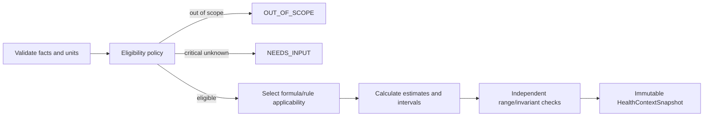

# Health context calculation

| Field         | Value                                       |
| ------------- | ------------------------------------------- |
| Status        | MVP baseline with provisional energy rule   |
| Audience      | Nutrition science, engine, product, quality |
| Owner         | Nutrixx Nutrition Science                   |
| Last reviewed | 2026-10-10                                  |

## Purpose

Health Context creates a dated, non-diagnostic input snapshot used to select
applicable target policy and planning constraints. A complete clinical health
state belongs to a qualified healthcare assessment.

## Stage 3 version 1 baseline

The pure [`@nutrixx/nutrition-engine`](https://github.com/shari-ar/Nutrixx/tree/main/packages/nutrition-engine)
implementation accepts the existing starting profile and an assessment time.
The dashboard entry contract stays unchanged. The snapshot records its rule
version, profile revision, assessment time, age range or exact age, physiological
reference, life-stage and activity evidence, goal, measurements, needed input,
and limitations. Reported age becomes a conservative range as time passes;
an optional birth date resolves it on the assessment date in the profile's IANA
timezone. Conflicting age evidence requests correction.

An omitted life stage defaults provisionally to adult and carries an explicit
assumption code. An explicitly unknown life stage, physiological reference, or
activity level remains visible in the snapshot. Target selection asks for
additional details only when the applicable result changes materially.
Declared pregnancy, lactation, or higher-risk context follows the
OUT_OF_SCOPE pathway. The baseline preserves height, weight, goal, and
activity as facts. Target selection follows
[target policy version 1](../nutrition-model/target-policy-v1.md).

### Maintenance energy

The provisional `nasem-eer-2023-v1` rule implements the
[National Academies' 2023 Tables 5-15 and 5-16](https://www.nationalacademies.org/read/26818/chapter/7)
for age 18 and ages 19–120, respectively. The formula uses age, height,
weight, physiological reference, and one of four physical-activity categories.
The age-18 equation includes the published energy cost of growth. Activity or
physiological reference is requested at calculation time when unresolved;
dashboard entry remains available beforehand. The result is an estimated
weight-maintenance requirement in kilocalories per day. A reported-age range
produces a range of age-scenario estimates, while model prediction uncertainty
remains stated as a separate limitation. Goal-specific energy changes belong
to the planning stage. Golden fixtures reproduce published adult reference
cases.

## Inputs

| Input family              | Examples                                                                    | Policy                                                                              |
| ------------------------- | --------------------------------------------------------------------------- | ----------------------------------------------------------------------------------- |
| Stable profile            | Date of birth, locale, timezone, attributes required by an accepted formula | Collect only if material; retain effective history                                  |
| Measurements              | Height, weight, body composition, blood pressure                            | Value, unit, time, method/source, uncertainty                                       |
| Behavior                  | Activity, sleep                                                             | Preserve measured versus self-reported/estimated                                    |
| Goals/preferences         | Direction, pace, cuisine, cost, schedule                                    | User-controlled and effective-dated                                                 |
| Optional clinical context | Conditions, medication, lab observation                                     | Consent-scoped; eligibility/guardrail use only until a reviewed policy permits more |

## Execution

Each derived field records formula/rule release, input references, validity
period, uncertainty/limitations, and whether it is observed, calculated,
estimated, or defaulted.

## Guardrails

- Date of birth produces the authoritative age at the calculation date.
- Sex-related physiological inputs and gender identity are distinct concepts;
  a formula requests only the precise attribute it scientifically requires.
- A formula is used only for its validated population.
- Unsupported illness, medication, lab, pregnancy, child, or therapeutic
  context yields OUT_OF_SCOPE or a reviewed safe pathway with explicit inputs.
- Lab data retains original analyte/code, specimen/context, unit, reference
  interval, time, and source. Diagnostic interpretation requires a qualified
  clinical process.
- Weight/energy predictions state horizon, baseline, interval, and limitations;
  they communicate guidance and uncertainty rather than guaranteed outcomes.

## Output

READY, NEEDS_INPUT, OUT_OF_SCOPE, or ERROR plus:

- eligible population/policy references;
- observed facts and derived estimates;
- explicit defaults and critical unknowns;
- confidence/uncertainty components;
- validity interval and refresh triggers;
- complete execution fingerprint.
