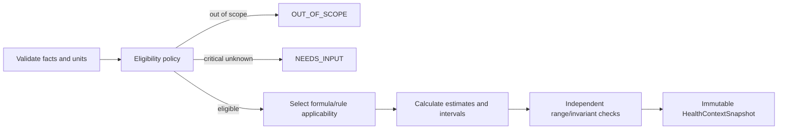

# Health context calculation

| Field         | Value                                          |
| ------------- | ---------------------------------------------- |
| Status        | Proposed; formulas require scientific approval |
| Audience      | Nutrition science, engine, product, quality    |
| Owner         | Nutrixx Nutrition Science                      |
| Last reviewed | 2026-09-22                                     |

## Purpose

Health Context creates a dated, non-diagnostic input snapshot used to select
applicable target policy and planning constraints. It does not claim to
represent a complete clinical health state.

## Inputs

| Input family              | Examples                                                                    | Policy                                                                              |
| ------------------------- | --------------------------------------------------------------------------- | ----------------------------------------------------------------------------------- |
| Stable profile            | Date of birth, locale, timezone, attributes required by an accepted formula | Collect only if material; retain effective history                                  |
| Measurements              | Height, weight, body composition, blood pressure                            | Value, unit, time, method/source, uncertainty                                       |
| Behavior                  | Activity, sleep                                                             | Preserve measured versus self-reported/estimated                                    |
| Goals/preferences         | Direction, pace, cuisine, cost, schedule                                    | User-controlled and effective-dated                                                 |
| Optional clinical context | Conditions, medication, lab observation                                     | Consent-scoped; eligibility/guardrail use only until a reviewed policy permits more |

## Execution

Each derived field records formula/rule release, input references, validity
period, uncertainty/limitations, and whether it is observed, calculated,
estimated, or defaulted.

## Guardrails

- Date of birth produces age at the calculation date; mutable stored “age” is
  not authoritative.
- Sex-related physiological inputs and gender identity are distinct concepts;
  a formula requests only the precise attribute it scientifically requires.
- A formula is used only for its validated population.
- Unsupported illness, medication, lab, pregnancy, child, or therapeutic
  context yields OUT_OF_SCOPE or a reviewed safe pathway—not silent defaults.
- Lab data retains original analyte/code, specimen/context, unit, reference
  interval, time, and source. It cannot by itself trigger a diagnosis.
- Weight/energy predictions state horizon, baseline, interval, and limitations;
  they do not guarantee an outcome.

## Output

READY, NEEDS_INPUT, OUT_OF_SCOPE, or ERROR plus:

- eligible population/policy references;
- observed facts and derived estimates;
- explicit defaults and critical unknowns;
- confidence/uncertainty components;
- validity interval and refresh triggers;
- complete execution fingerprint.
