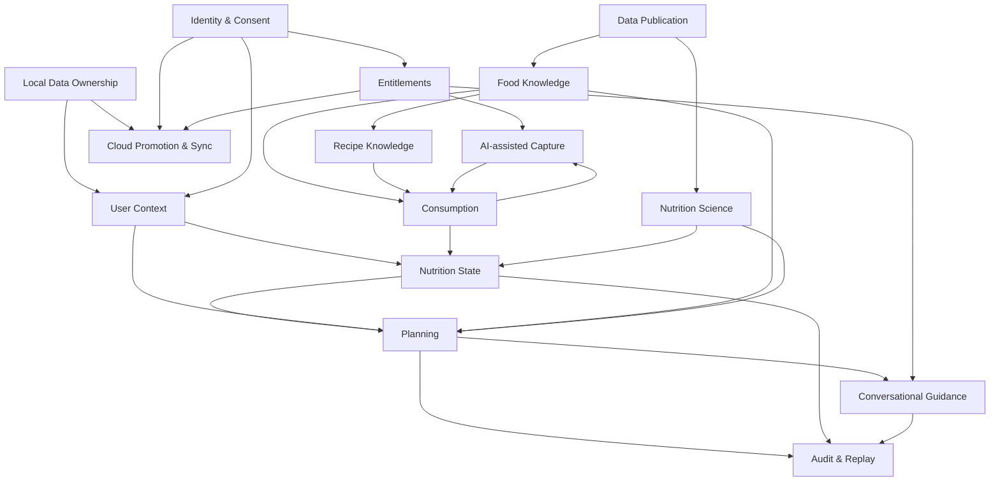

# Capability map

| Field         | Value                    |
| ------------- | ------------------------ |
| Status        | Target state             |
| Audience      | Product and architecture |
| Owner         | Nutrixx Product          |
| Last reviewed | 2026-09-27               |

| Capability                | User value                                           | Owning domain             | Key output                              |
| ------------------------- | ---------------------------------------------------- | ------------------------- | --------------------------------------- |
| Identity, access, consent | Safe control of an account and optional data         | Identity & Consent        | Principal, session, consent grant       |
| Progressive onboarding    | Useful start with minimal effort                     | User Context              | Versioned profile facts and eligibility |
| Food discovery            | Find an appropriate food or portion quickly          | Food Knowledge            | Food observation with provenance        |
| Recipe authoring          | Reuse exact preparations                             | Recipe Knowledge          | Immutable recipe version and yield      |
| Meal capture              | Record what actually happened                        | Consumption               | Meal and item facts                     |
| Activity/context capture  | Add optional context that improves interpretation    | User Context              | Sourced observation                     |
| Nutrition calculation     | Understand nutrient intake without manual arithmetic | Nutrition Science         | Calculation snapshot                    |
| Daily state               | See coverage, excess, uncertainty, and trends        | Nutrition State           | Daily/period state snapshot             |
| Planning and optimization | Receive feasible, practical next actions             | Planning                  | Validated plan and alternatives         |
| Explanation               | Understand the result and its limitations            | Planning & Explainability | Evidence-linked explanation             |
| Data publication          | Improve knowledge without corrupting history         | Data Platform             | Immutable dataset release               |
| Scientific governance     | Keep policies reviewable and current                 | Nutrition Science         | Approved rule-set release               |
| Audit and replay          | Reproduce important outcomes                         | Audit & Provenance        | Run fingerprint and trace               |
| Operations and support    | Keep the service trustworthy                         | Platform Operations       | SLOs, alerts, runbooks, evidence        |
| Local data ownership      | Use the complete free product without cloud custody  | Data Portability & Sync   | Local canonical store and export bundle |
| Cloud promotion and sync  | Recover and use data across devices                  | Data Portability & Sync   | Verified migration and sync protocol    |
| Subscription entitlements | Receive clear, consistently enforced plan benefits   | Commerce & Entitlements   | Versioned entitlement grant             |
| AI-assisted capture       | Convert a short description into an editable draft   | AI Orchestration          | Validated capture draft                 |
| Conversational guidance   | Ask grounded questions about an existing plan        | AI Orchestration          | Evidence-linked response and tool trace |

## Capability dependencies

Dependencies indicate information flow, not permission for one domain to write
another domain's tables.
