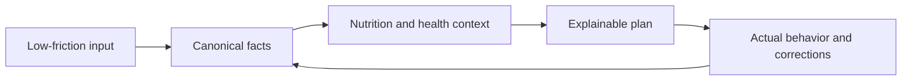

# Product constitution

| Field         | Value                                 |
| ------------- | ------------------------------------- |
| Status        | Proposed target state                 |
| Audience      | All contributors and decision-makers  |
| Owner         | Nutrixx Product and Nutrition Science |
| Last reviewed | 2026-09-22                            |

## Mission

Nutrixx turns the smallest practical amount of user input—what a person ate,
what they did, and optional health context—into precise, understandable, and
actionable nutrition guidance across macro- and micronutrients.

## Intended use

The first product is a general-wellness nutrition assistant for consenting
adults. It helps users record consumption, understand nutritional patterns, and
generate practical meal plans. It does not diagnose, treat, cure, or prevent
disease and does not replace a qualified clinician.

The default release scope excludes children, pregnancy or lactation, eating
disorders, therapeutic diets, medication changes, acute illness, and clinical
decision-making. Supporting any excluded population requires an accepted
clinical policy, qualified ownership, jurisdiction review, and separate
validation evidence.

## Constitutional principles

| ID   | Principle             | Non-negotiable consequence                                                                                                      |
| ---- | --------------------- | ------------------------------------------------------------------------------------------------------------------------------- |
| P-01 | Minimum effort        | Ask only for information that can materially change the next useful result; progressively request missing critical facts.       |
| P-02 | Scientific humility   | Guidance expresses evidence, applicability, uncertainty, and limitations; it never converts a weak signal into a medical claim. |
| P-03 | Unknown is not zero   | Missing, measured-zero, estimated, imputed, and not-applicable values remain distinct throughout the system.                    |
| P-04 | Deterministic core    | Units, nutrient arithmetic, target evaluation, and safety constraints are executed by versioned deterministic engines.          |
| P-05 | Reproducibility       | Every derived state and plan can be replayed from immutable input, data, policy, engine, and solver versions.                   |
| P-06 | Safety before score   | A preference or business objective can never compensate for a violated hard safety rule.                                        |
| P-07 | Explainability        | A recommendation states why it was made, what assumptions were used, what remains unmet, and how reliable the inputs are.       |
| P-08 | User agency           | Users can correct facts, control optional data, inspect important assumptions, export data, and request deletion.               |
| P-09 | Privacy by design     | Collect the minimum needed, isolate sensitive data, protect it in transit and at rest, and prohibit it from telemetry.          |
| P-10 | Cultural practicality | Food availability, cuisine, budget, preparation time, and preference are first-class planning inputs.                           |

## Product loop

The loop improves data quality and relevance without pretending that repeated
use alone proves health causality.

## What success means

Nutrixx succeeds when users can log reality quickly, see which conclusions are
well-supported, receive feasible recommendations, and understand trade-offs.
Product success is evaluated through correction burden, recommendation
acceptance, sustained logging, constraint violations, data completeness, and
scientifically defined outcome metrics—not engagement alone.

## Non-goals

- Replacing dietitians, physicians, laboratories, or emergency services.
- Claiming deficiency or disease from short-term dietary intake.
- Producing an apparently precise answer when critical data is unavailable.
- Using a generative model as the authority for arithmetic, safety, or dosage.
- Maximizing the number of tracked nutrients without evidence that they change
  a decision.
- Locking the domain model to one food database, country, solver, or cloud.

## External policy anchors

- [NIH Office of Dietary Supplements: nutrient recommendations](https://ods.od.nih.gov/HealthInformation/nutrientrecommendations/)
- [FDA General Wellness policy](https://www.fda.gov/regulatory-information/search-fda-guidance-documents/general-wellness-policy-low-risk-devices)
- [NIST AI Risk Management Framework](https://www.nist.gov/itl/ai-risk-management-framework)
