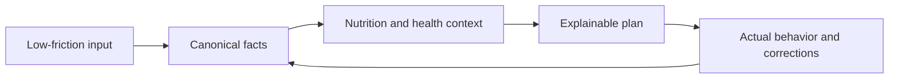

# Product constitution

| Field         | Value                                 |
| ------------- | ------------------------------------- |
| Status        | Proposed target state                 |
| Audience      | All contributors and decision-makers  |
| Owner         | Nutrixx Product and Nutrition Science |
| Last reviewed | 2026-09-27                            |

## Mission

Nutrixx turns the smallest practical amount of user input—what a person ate,
what they did, and optional health context—into precise, understandable, and
actionable nutrition guidance across macro- and micronutrients.

## Intended use

### Initial market and supported population

The initial product is a direct-to-consumer general-wellness nutrition
assistant for consenting adults aged 18 or older, designed first for Persian-
and English-speaking users and released only in jurisdictions cleared in the
regulatory-applicability matrix. It supports food and activity recording,
nutrition-pattern education, and practical meal planning for generally healthy
adults; it does not diagnose, treat, cure, or prevent disease, and its wording,
recommendations, and marketing must remain within that boundary.

### Clinical and higher-risk contexts

Nutrixx may let users record conditions, medications, laboratory observations,
pregnancy or lactation, age-related context, eating-disorder concerns, or other
higher-risk facts to make data entry easier, identify missing or contradictory
inputs, show conservative warnings, and prepare information for discussion
with a physician. These safeguards reduce avoidable mistakes but provide no
guarantee of safety, correctness, or clinical suitability: the product must
not recommend medication changes or act as the decision authority, and a user
in any such context must obtain their physician's approval before acting on a
Nutrixx result rather than treating the site as medical guidance. Children and
therapeutic or acute-care use remain outside the supported planning population.

## Constitutional principles

| ID   | Principle             | Non-negotiable consequence                                                                                                                                        |
| ---- | --------------------- | ----------------------------------------------------------------------------------------------------------------------------------------------------------------- |
| P-01 | Minimum effort        | Ask only for information that can materially change the next useful result; progressively request missing critical facts.                                         |
| P-02 | Scientific humility   | Guidance expresses evidence, applicability, uncertainty, and limitations; it never converts a weak signal into a medical claim.                                   |
| P-03 | Unknown is not zero   | Missing, measured-zero, estimated, imputed, and not-applicable values remain distinct throughout the system.                                                      |
| P-04 | Deterministic core    | Units, nutrient arithmetic, target evaluation, and safety constraints are executed by versioned deterministic engines.                                            |
| P-05 | Reproducibility       | Every derived state and plan can be replayed from immutable input, data, policy, engine, and solver versions.                                                     |
| P-06 | Safety before score   | A preference or business objective can never compensate for a violated hard safety rule.                                                                          |
| P-07 | Explainability        | A recommendation states why it was made, what assumptions were used, what remains unmet, and how reliable the inputs are.                                         |
| P-08 | User agency           | Users can correct facts, control optional data, inspect important assumptions, export data, and request deletion.                                                 |
| P-09 | Privacy by design     | Collect the minimum needed, isolate sensitive data, protect it in transit and at rest, and prohibit it from telemetry.                                            |
| P-10 | Cultural practicality | Food availability, cuisine, budget, preparation time, and preference are first-class planning inputs.                                                             |
| P-11 | Local-first ownership | Free users receive a complete useful product whose nutrition data is locally authoritative, portable, and usable without a Nutrixx cloud dependency.              |
| P-12 | Customer sovereignty  | Corrections, exports, plan changes, upgrades, downgrades, and consequential AI actions are transparent, reversible where possible, and never designed as lock-in. |

## Product loop

The loop improves data quality and relevance without pretending that repeated
use alone proves health causality.

The same canonical facts and deterministic engines power both local and cloud
modes. A subscription changes storage, synchronization, hosted-compute, and
service allowances; it does not change the scientific meaning of a fact.

## What success means

Nutrixx succeeds when users can log reality quickly, see which conclusions are
well-supported, receive feasible recommendations, and understand trade-offs.
Product success is evaluated through correction burden, recommendation
acceptance, sustained logging, constraint violations, data completeness, and
scientifically defined outcome metrics—not engagement alone.

“The customer is always right” is implemented as customer sovereignty:
respectful support, clear limits, correction rights, portability, recovery,
and fair failure handling. It never overrides scientific evidence, safety,
law, another person's rights, or proportionate abuse controls.

## Non-goals

- Replacing dietitians, physicians, laboratories, or emergency services.
- Claiming deficiency or disease from short-term dietary intake.
- Producing an apparently precise answer when critical data is unavailable.
- Using a generative model as the authority for arithmetic, safety, or dosage.
- Maximizing the number of tracked nutrients without evidence that they change
  a decision.
- Locking the domain model to one food database, country, solver, or cloud.
- Making essential manual tracking conditional on a paid subscription.
- Using deliberately difficult export, cancellation, or downgrade flows to
  retain a customer.

## External policy anchors

- [NIH Office of Dietary Supplements: nutrient recommendations](https://ods.od.nih.gov/HealthInformation/nutrientrecommendations/)
- [FDA General Wellness policy](https://www.fda.gov/regulatory-information/search-fda-guidance-documents/general-wellness-policy-low-risk-devices)
- [NIST AI Risk Management Framework](https://www.nist.gov/itl/ai-risk-management-framework)
