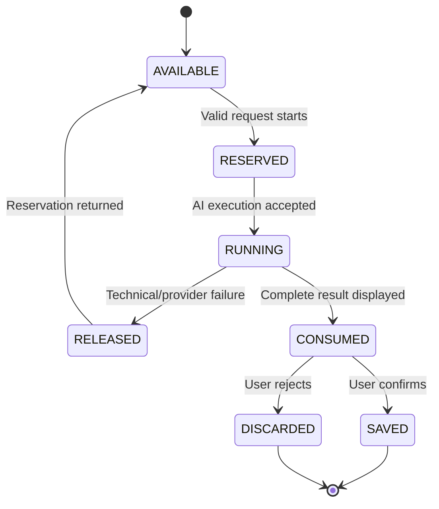

# Plans and entitlements

| Field         | Value                                     |
| ------------- | ----------------------------------------- |
| Status        | Proposed target product policy            |
| Audience      | Product, engineering, support, operations |
| Owner         | Nutrixx Product                           |
| Last reviewed | 2026-09-27                                |

This document is the human-readable authority for plan capabilities. Prices,
taxes, promotions, and market-specific packaging are commercial configuration,
not architectural constants. Runtime entitlements MUST be generated from or
validated against a versioned machine-readable catalog before paid plans launch.

## Product plans

| Capability                              | Free                                                  | Pro                                            | Ultimate                                       |
| --------------------------------------- | ----------------------------------------------------- | ---------------------------------------------- | ---------------------------------------------- |
| Nutrition-data authority                | Browser-local database                                | Nutrixx cloud                                  | Nutrixx cloud                                  |
| Devices                                 | One browser profile at a time                         | Multi-device                                   | Multi-device                                   |
| Manual meal capture                     | Unlimited                                             | Unlimited                                      | Unlimited                                      |
| Manual recipe authoring                 | Unlimited                                             | Unlimited                                      | Unlimited                                      |
| Hosted AI meal capture                  | Not included                                          | 5 successful actions per local day             | 50 successful actions per local day            |
| Hosted AI recipe creation               | Not included                                          | 2 successful actions per billing cycle         | 20 successful actions per billing cycle        |
| Optimizer                               | Local approximate profile; no AI-dependent capability | Full eligible optimizer without a user API key | Full eligible optimizer without a user API key |
| Cloud persistence, backup, and recovery | Not included                                          | Included                                       | Included                                       |
| Conversational plan assistant           | Not included                                          | Not included                                   | Included                                       |

All plans receive the same scientific definitions, deterministic nutrient
arithmetic, safety rules, correction rights, and manual data portability. A
paid entitlement MUST NOT weaken safety or make a scientifically unsupported
claim available.

## Free mode

Free is a complete local-first product, not a time-limited cloud trial. User
nutrition content, derived states, plans, and preferences remain in the
browser. Nutrixx servers MAY hold only the minimum service data needed for an
account the user chooses to create, security/abuse prevention, support, and a
future purchase; they MUST NOT receive Free nutrition content implicitly.

Free includes manual export and import. Browser storage is best-effort and can
be cleared by the user, browser, device policy, or storage pressure; the product
MUST communicate that limitation and offer storage-health and backup guidance.

### Experimental Local Processing

`Experimental Local Processing` is an Advanced Settings capability for Free
users. It is not advertised as a plan benefit and MUST never download a model
or contact an AI provider without a separate, informed user action.

An enabled implementation MAY provide:

- user-supplied-provider access when requests can go directly from the browser;
- provider OAuth with Authorization Code and PKCE where supported;
- user-initiated WebGPU/WASM model download and local inference;
- local assistance that converts text, speech, or images into a reviewable
  structured draft.

The activation screen MUST state download size, hardware/browser requirements,
data destination, provider terms, API-key handling, removal steps, and fallback
behavior. A bearer key is session-only by default. Persistent local storage of
a user key requires a separate opt-in and a truthful warning: Nutrixx servers
do not receive the key, but code executing in the Nutrixx origin can exercise
the credential. The product MUST NOT claim that ordinary website JavaScript is
cryptographically unable to access it.

Experimental Local Processing does not unlock hosted AI, cloud persistence,
multi-device sync, or AI-dependent optimizer capabilities.

## AI-action accounting

An AI meal action creates one proposed meal containing one or more food items.
An AI recipe action creates one proposed recipe version. The user supplies and
validates the minimum critical facts before execution.

Rules:

- reservation and finalization are atomic and idempotent;
- validation failures, cancellations before execution, and technical/provider
  failures do not consume an action;
- an action is consumed when a complete result is made available to the user,
  whether the user later confirms or rejects it;
- manual corrections do not consume another action;
- a new AI execution consumes a new action unless it resumes the same
  idempotent job after a technical interruption;
- daily limits use the user's effective IANA timezone; timezone changes are
  recorded and cannot reset the current allowance;
- monthly limits reset on the subscription billing boundary;
- quota numbers and reset policy are versioned entitlement configuration, not
  hard-coded UI or application constants.

## Ultimate assistant

Ultimate includes a conversational assistant grounded in the user's current,
authorized Nutrixx data. The model receives no direct database or unrestricted
network access. It uses allowlisted, typed tools and least-privilege scopes.
Read tools disclose only the minimum needed context; any consequential write or
plan-changing action requires an explicit preview and user confirmation.

The assistant can explain validated results, retrieve allowed facts, compare
plans, and initiate supported workflows. It cannot override eligibility,
scientific policy, hard safety constraints, entitlement checks, or independent
result validation. Its usage allowance and text/voice packaging require a
separate approved entitlement policy before Ultimate launch.

## Plan transitions

Upgrade and downgrade are data migrations, not billing toggles. Upgrade to a
cloud plan completes only after server-side receipt, schema/version checks,
record-count and content-hash verification, and activation of the cloud copy.
The full local database is removed only after success, recovery evidence, and
clear user confirmation; a bounded disposable cache MAY remain.

Downgrade first creates and verifies a complete local copy. Cloud data enters a
documented read-only grace period and is deleted according to the accepted
retention policy only after local activation succeeds. Payment failure MUST NOT
cause immediate data loss or make export unavailable.

See [storage-mode lifecycle](../domain/storage-mode-lifecycle.md) for the state
machine and failure semantics.

## Customer sovereignty

Nutrixx defaults service and support decisions toward the customer: clear
limits, correctable facts, reversible actions, portable data, understandable
charges, and accessible recovery. This posture cannot authorize an unsafe
recommendation, falsify scientific evidence, break law, harm another user, or
bypass abuse controls. When a requested outcome is unsafe or unsupported, the
system explains the boundary and offers the closest safe alternative.
