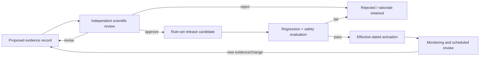

# Scientific evidence policy

| Field         | Value                                              |
| ------------- | -------------------------------------------------- |
| Status        | Proposed; requires qualified scientific governance |
| Audience      | Nutrition science, product, data, engine, quality  |
| Owner         | Nutrixx Nutrition Science                          |
| Last reviewed | 2026-09-22                                         |

## Evidence record

Every scientific rule or claim has:

- a stable claim/rule ID and exact machine-readable consequence;
- primary source citation, version/publication date, and accessed/reviewed date;
- population, geography, exposure/dose, outcome, and time horizon;
- evidence type, quality/applicability assessment, and known limitations;
- conflicts or uncertainty in the evidence;
- reviewer identity/qualification and approval status;
- effective/sunset dates and scheduled review;
- affected engine fixtures, metrics, and user-facing language.

Approval requires qualified review in addition to a citation. Secondary
summaries may aid discovery while normative policy traces to
authoritative/primary sources.

## Lifecycle

Product-approved, conservative implementation policies may guide inactive
Stage 3 engineering before independent scientific review. Activation of a
scientific rule or user-facing scientific comparison requires the qualified
review, evaluation, and effective-dated release process below. An accepted
implementation ADR records the engineering choice; its pending release-review
field records the remaining scientific gate.

High-consequence target limits, eligibility, interactions, and clinical
exclusions require qualified review and dual approval. Emergency withdrawal is
possible through a kill switch/policy rollback with incident follow-up.

## Claims policy

- Diagnosis requires a qualified clinical process beyond intake comparison.
- Causal claims require causal evidence beyond association.
- Observed outcomes and model predictions retain distinct labels.
- “Personalized” means inputs and approved policies affect output; individual
  clinical validation requires a dedicated clinical process.
- Displayed precision stays within evidence and data precision.
- Unsupported, disputed, population-mismatched, or stale rules remain inactive.
- User-facing language is reviewed together with the algorithm, because wording
  can change intended use and risk.

## Source hierarchy

Preferred sources include authoritative reference-intake bodies, official food
composition documentation, peer-reviewed systematic evidence, and validated
standards. Selection also considers applicability to launch geography and
population. Where authorities disagree, the rule records the selection
rationale and preserves incompatible values as distinct alternatives.

## Change control

Scientific releases are immutable and semantically versioned according to
impact. Activation requires impact analysis against representative historical
cases, safety fixtures, subgroup reports, explanation snapshots, and a rollback
plan. Material output changes are communicated to product and operations.
