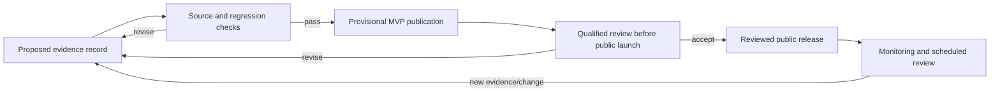

# Scientific evidence policy

| Field         | Value                                                      |
| ------------- | ---------------------------------------------------------- |
| Status        | MVP policy; qualified clinical review before public launch |
| Audience      | Nutrition science, product, data, engine, quality          |
| Owner         | Nutrixx Nutrition Science                                  |
| Last reviewed | 2026-09-22                                                 |

## Evidence record

Every scientific rule or claim has:

- a stable claim/rule ID and exact machine-readable consequence;
- primary source citation, version/publication date, and accessed/reviewed date;
- population, geography, exposure/dose, outcome, and time horizon;
- evidence type, quality/applicability assessment, and known limitations;
- conflicts or uncertainty in the evidence;
- publication status and accountable author; reviewer identity and qualifications once reviewed;
- effective/sunset dates and scheduled review;
- affected engine fixtures, metrics, and user-facing language.

Provisional MVP publication requires a source citation, accountable author,
documented applicability, and tests. Qualified review of the completed product
and its rules precedes public launch. Secondary summaries may aid discovery
while normative policy traces to authoritative/primary sources.

## Lifecycle

Conservative, source-derived policies may be published provisionally during
MVP development after traceability and regression checks. Their outputs carry
the provisional status. The completed product and its scientific releases
receive qualified clinical review, evaluation, and any resulting corrections
before public launch. An accepted implementation ADR records the engineering
choice and its public-launch review status.

High-consequence target limits, eligibility, interactions, and clinical
exclusions use conservative MVP boundaries and receive qualified review before
public launch. Emergency withdrawal is possible through a kill switch/policy
rollback with incident follow-up.

## Claims policy

- Diagnosis requires a qualified clinical process beyond intake comparison.
- Causal claims require causal evidence beyond association.
- Observed outcomes and model predictions retain distinct labels.
- “Personalized” means inputs and published policies affect output; individual
  clinical validation requires a dedicated clinical process.
- Displayed precision stays within evidence and data precision.
- Unsupported, disputed, population-mismatched, or stale rules remain inactive.
- User-facing language and the algorithm receive joint review before public
  launch, because wording can change intended use and risk.

## Source hierarchy

Preferred sources include authoritative reference-intake bodies, official food
composition documentation, peer-reviewed systematic evidence, and validated
standards. Selection also considers applicability to launch geography and
population. Where authorities disagree, the rule records the selection
rationale and preserves incompatible values as distinct alternatives.

## Change control

Scientific releases are immutable and semantically versioned according to
impact. Provisional MVP publication includes impact analysis against
representative cases, safety fixtures, explanation snapshots, and a rollback
plan. Public release adds qualified review and subgroup evaluation. Material
output changes are communicated to product and operations.
