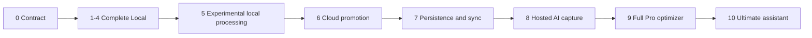

# Delivery roadmap

| Field         | Value                                            |
| ------------- | ------------------------------------------------ |
| Status        | Proposed                                         |
| Audience      | Product, engineering, science, quality, security |
| Owner         | Nutrixx Product                                  |
| Last reviewed | 2026-09-27                                       |

Work is sequenced around one rule: finish the useful local product before cloud
custody or paid hosted capabilities. Each stage has independently reviewable
evidence, but Pro and Ultimate are not publicly offered until their complete
published plan contract passes its cumulative launch gate.

## Stage 0 — Product, science, privacy, and canonical contract

Deliver intended use/exclusions, glossary, storage-neutral canonical model,
scientific governance, source/license strategy, golden fixtures, plan policy,
privacy lifecycle, threat model, ADRs, and contract conventions.

Exit: all P0 decisions required by the first local slice are approved, and one
source-to-explanation golden case is reproducible without a server database.

## Stage 1 — Local data foundation

Deliver browser repository adapters, schema/migration runner, local transaction
log, versioned export/import, storage/persistence status, reference-release
caching, clear-data control, and adapter conformance suites.

Exit: historical-schema, interruption, offline reload, quota-pressure, export/
import integrity, and supported-browser fixtures pass without silent upload.

## Stage 2 — Local food, recipe, and intake ledger

Deliver progressive account-optional onboarding, food/portion/composition,
recipe versions/yield, unlimited manual meal/recipe capture and correction,
provenance, unknown-versus-zero, completeness, and the first catalog release.

Exit: food/meal/recipe golden cases pass and ordinary manual logging meets
approved task-time, accessibility, integrity, and recovery objectives.

## Stage 3 — Local nutrition and health context

Deliver approved Health Context rules, daily/rolling Nutrition State, targets,
uncertainty, contributor explanations, trends, and local version impact/
recomputation.

Exit: fingerprint and scientific/regression gates pass; evaluated users do not
mistake dietary state for diagnosis; the workflow remains useful offline.

## Stage 4 — Complete Free local planning

Deliver deterministic local approximate planning, eligibility, hard/soft
constraints appropriate to the profile, independent validation, infeasibility,
safe alternatives, and evidence-linked explanation.

Exit: the complete advertised Free contract passes; mandatory fixtures show
zero escaped hard violations. AI-dependent optimizer features remain excluded.

## Stage 5 — Experimental Local Processing

Deliver an off-by-default Advanced Setting, provider OAuth/BYOK adapters where
safe, optional user-approved WebGPU/WASM model install, typed capture drafts,
compatibility/size/privacy disclosures, cancellation, cleanup, and fallback.

Exit: credentials and local data cannot leak through Nutrixx telemetry/server;
model/provider failure cannot corrupt facts; activation is explicit and never
presented as necessary for Free.

## Stage 6 — Account, commerce, and verified cloud promotion

Deliver cloud identity/consent, payment event adapter, versioned entitlement
catalog, usage ledger, encrypted staging, migration manifest verification,
single authority switching, downgrade/export, grace and deletion workflows.

Exit: billing/entitlement replay, migration fault injection, recovery, privacy,
support adjustment, and no-data-loss downgrade tests pass.

## Stage 7 — Pro persistence and multi-device sync

Deliver PostgreSQL cloud authority, bounded device cache/outbox, command IDs,
version/cursor protocol, explicit conflict semantics, encrypted backup/PITR,
restore drills, device/session management, and operational SLOs.

Exit: multi-device convergence, offline/reconnect, conflict, backup/restore,
security isolation, and cloud export/deletion gates pass.

## Stage 8 — Pro hosted AI capture

Deliver five successful AI meal captures per effective local day and two AI
recipe creations per billing cycle, with reserve/consume/release accounting,
editable drafts, confirmation, provider budgets, evaluation, and support trace.
Manual capture remains unlimited.

Exit: concurrency/retry/reconciliation, typed-output, ambiguity, privacy,
provider-outage, cost, and multilingual quality gates pass.

## Stage 9 — Full Pro optimizer

Deliver the complete eligible server optimizer without a user API key: durable
jobs, expanded candidate/solver capability, independent validator, replay,
freshness gate, explanations, kill switch, cost and SLO controls.

Exit: the whole advertised Pro contract passes cumulative Free-through-Pro
launch gates and support/recovery is staffed and rehearsed.

## Stage 10 — Ultimate capacity and conversational assistant

Deliver 50 successful AI meal captures per effective local day, 20 AI recipe
creations per billing cycle, and the grounded assistant with allowlisted typed
tools, least-privilege context, explicit confirmation for writes/consequential
actions, immutable traces, abuse/cost controls, refusal, and kill switches.

Exit: assistant grounding, prompt/tool injection, ownership, confirmation,
retention, capacity, support, and incident exercises pass; the complete
Ultimate contract is ready.

## Stage 11 — Optional validated expansion

Candidates include device/activity/sleep imports, laboratory observations and
professional pathways, calibrated predictions, inventory/household/cost/
availability/shopping, and additional regional catalogs. Every candidate starts
with purpose/consent, intended-use/regulatory review, evidence plan, adapter
contract, threat-model delta, evaluation, and independent off-switch.
