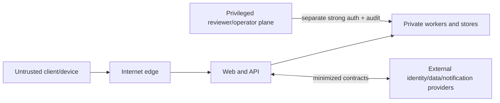

# Threat model

| Field         | Value                                                                 |
| ------------- | --------------------------------------------------------------------- |
| Status        | Initial target-state model; review at every material data-flow change |
| Audience      | Architecture, engineering, security, operations                       |
| Owner         | Nutrixx Security                                                      |
| Last reviewed | 2026-09-22                                                            |

## Protected assets

- credentials, sessions, consent grants, and authorization policy;
- profile, food intake, goals, measurements, optional clinical observations,
  and inferred/derived states;
- scientific policies, curated datasets, optimizer inputs/results, and release
  approvals;
- provenance/audit evidence, encryption material, and operational secrets;
- service availability and the integrity of user-visible guidance.

## Trust boundaries

Raw imports, user text, uploaded files, external callbacks, generated content,
and provider claims are untrusted until validated.

## Priority threats and controls

| Threat                      | Example                                 | Required design response                                                                                     |
| --------------------------- | --------------------------------------- | ------------------------------------------------------------------------------------------------------------ |
| Account/session compromise  | Credential stuffing, token theft        | Provider-grade auth, MFA support, PKCE, secure cookie/token handling, session revocation, rate/risk controls |
| Broken object authorization | Reading another user's meals or plan    | Deny-by-default ownership checks in application layer, opaque IDs, negative integration tests                |
| Sensitive data disclosure   | Health/intake data in logs or analytics | Data classification, allowlisted telemetry, redaction, encryption, least privilege, egress review            |
| Scientific/data tampering   | Altered target policy or food source    | Signed/checksummed artifacts, immutable releases, dual approval for high-risk policy, audit trail            |
| Optimizer manipulation      | Prompt/input causes unsafe plan         | Typed bounded inputs, eligibility gate, hard constraints, independent validator, no LLM safety authority     |
| Supply-chain compromise     | Malicious dependency/image/action       | Lockfiles, reviewed updates, pinned actions/images, SBOM, provenance/signing, vulnerability and secret scans |
| Import/parser abuse         | Malformed large source artifact         | Quarantine, size/type limits, malware scan, isolated parsing, schema/range checks                            |
| Queue/replay abuse          | Duplicate planning jobs                 | Idempotency, authenticated messages, leases, bounded retry, deduplication                                    |
| Availability attack         | Expensive searches or solve requests    | Edge/API rate limits, quotas, time/size budgets, async isolation, circuit breakers                           |
| Privileged misuse           | Reviewer silently changes policy        | Least privilege, separate admin plane, step-up auth, attributable approval, immutable audit                  |
| Inference/model leakage     | Explanations reveal sensitive facts     | Output policy, minimization, ownership filtering, adversarial evaluation                                     |

## Process

For each material feature:

1. update the data-flow diagram and classifications;
2. enumerate threats across spoofing, tampering, repudiation, disclosure,
   denial of service, and privilege escalation;
3. connect each accepted risk to a control, test, owner, and release gate;
4. record residual risk and approval;
5. verify production signals and incident response.

The model is reviewed after incidents, new integrations, new sensitive fields,
architecture boundary changes, and at least annually.

Reference: [OWASP Threat Modeling Cheat Sheet](https://cheatsheetseries.owasp.org/cheatsheets/Threat_Modeling_Cheat_Sheet.html).
